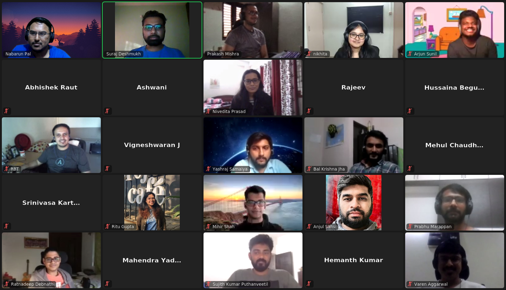
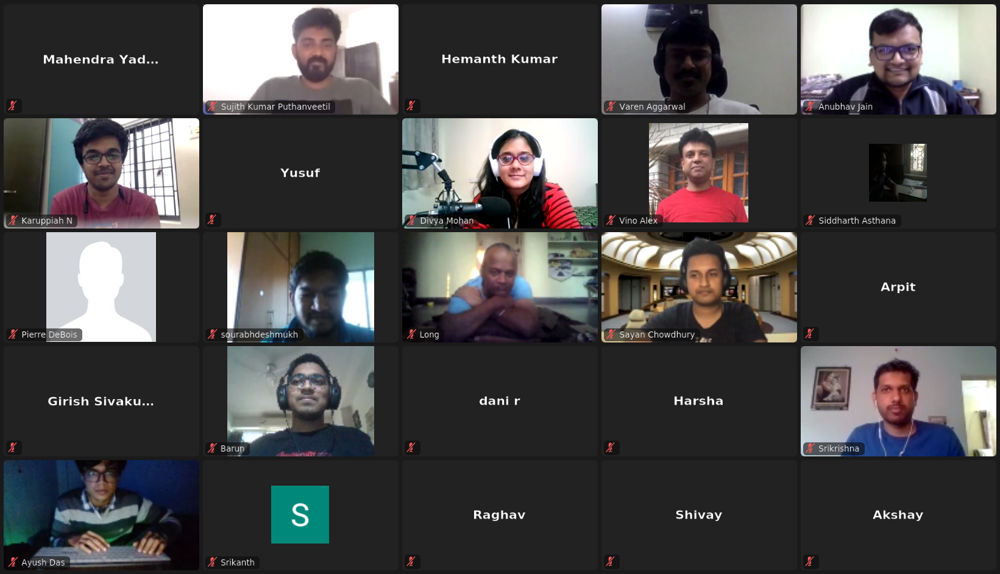

# Kubernetes Bangalore 2021 Meetup

Welcome to [Kubernetes New Contributor Workshop](https://www.meetup.com/kubernetes-openshift-India-Meetup/events/276264201/)!

In this meetup, we will learn how to contribute to the Kubernetes and participate in various avenues of the community.

## Planned Agenda

- Introduction to the Kubernetes Community
- Experiences of contributors from India
- Community groups overview
- Communication in the k8s community
- Kubernetes community repositories tour
- kubernetes/kubernetes walkthrough
- Break for 10mins
- Introduction to labels, bots and GitHub Workflow
- How to find your first issue?
- Live PR demo
- How and where can you help?
- Break for 10mins
- Hands-on session + Questions
- Swags!

## Resources

- Slides URL: [here](http://bit.ly/k8sblr-contributing-101)
- [Attendee instructions](attendee-instructions.md)
- Contributor Documentation
  - [Contributor guide](https://www.kubernetes.dev/docs/guide/)
  - [Contributor cheatsheet](https://www.kubernetes.dev/docs/contributor-cheatsheet/)
  - [Developer guide](https://github.com/kubernetes/community/tree/master/contributors/devel)

## Facilitators

#### Nabarun Pal (**[@palnabarun](https://github.com/palnabarun)**)

Nabarun is a Member of Technical Staff at VMware and the Kubernetes 1.21 Release Lead. He helps with several other subprojects in the Kubernetes community like Enhancements, API Machinery, Kubernetes Clients. He has dabbled with multiple software industry domains ranging from web services to data pipelines to infrastructure. Nabarun also actively contributes to and mentors new contributors in diverse open source communities like Kubernetes and Python.

#### Nikhita Raghunath (**[@nikhita](https://github.com/nikhita)**)

Nikhita is a Senior Member of Technical Staff at VMware, a member of the Kubernetes Steering Committee and a CNCF Ambassador. She is also the technical lead for a Special Interest Group (SIG) - SIG Contributor Experience - in the upstream Kubernetes project. She also helps run the Google Summer of Code (GSoC) and Outreachy internship programs for CNCF/Kubernetes.

#### Divya Mohan (**[@divya-mohan0209](https://github.com/divya-mohan0209)**)

Alongside her day job as a Senior Systems Engineer at HSBC, Divya has been contributing to the k8s community for almost a year now in various capacities. She's the SIG Docs lead for another project under the CNCF umbrella, LitmusChaos & is a CNCF ambassador. Outside of work commitments, she loves speaking about her (mis)adventures in the Cloud Native space & tweeting cat photos.
