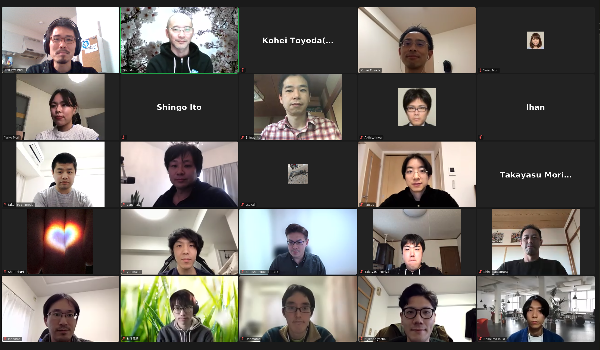
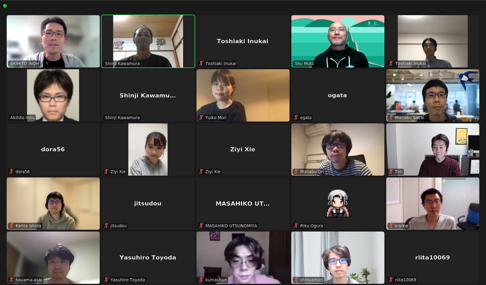
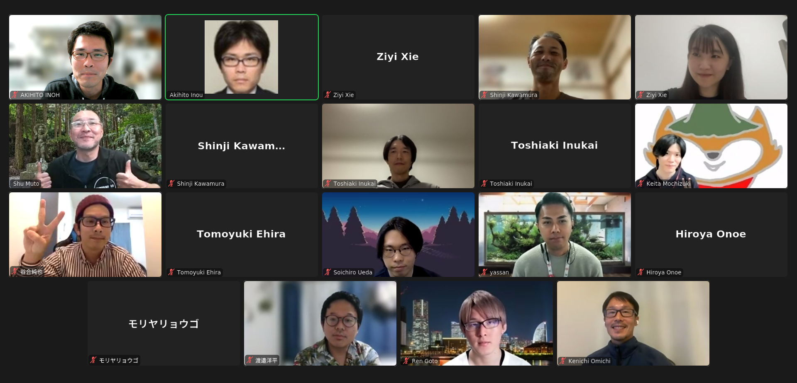
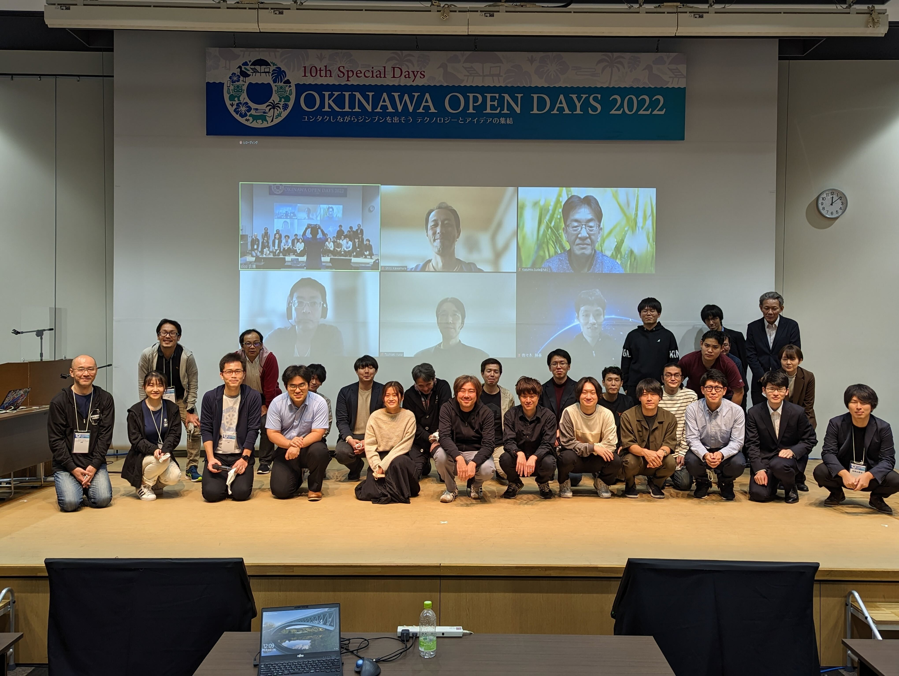
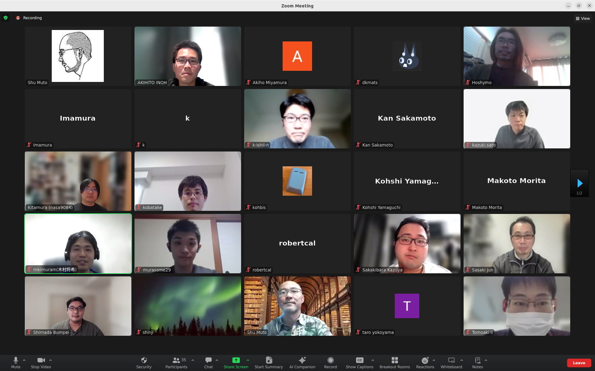
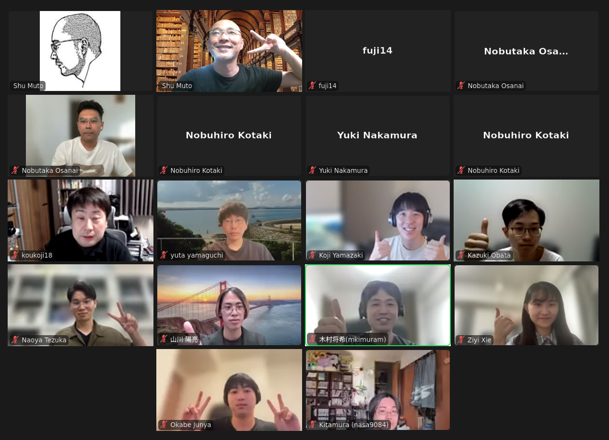
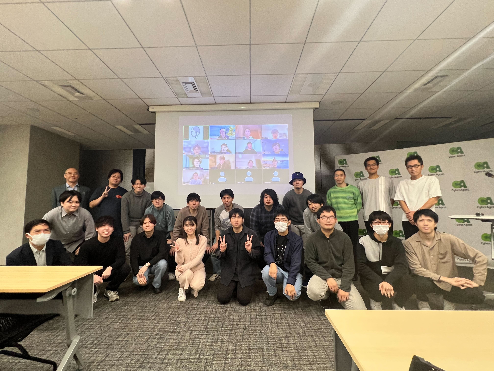
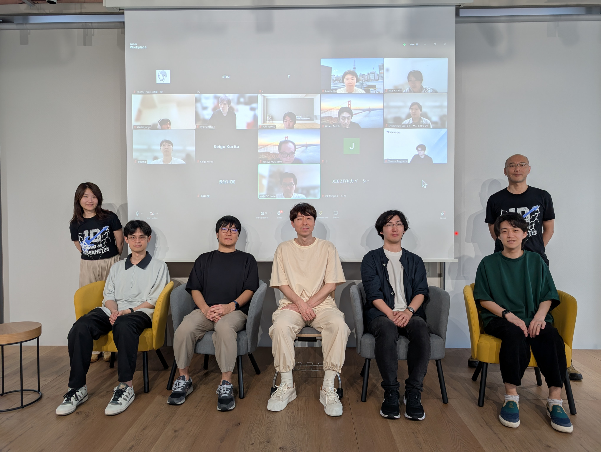
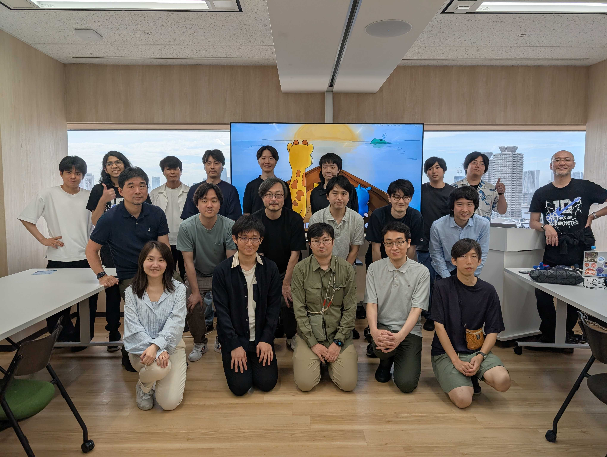

# Kubernetes Contributor Playground for Japan

Hello new contributors!

新コントリビュータの皆さんこんにちは！

This repository will be used as a safe space for participants in the New Contributor Onboarding Track to familiarize themselves with (some of) the Kubernetes Project's review and pull request processes.

このリポジトリは、(いくつかの)Kubernetesのプロジェクトにおけるレビューやプルリクエストのプロセスに慣れるために、Kubernetesアップストリームトレーニング参加者の安全な場所として使います。

Each subfolder under `japan/` contains `assets` for kubernetes upstream training held in events at Japan or for self-study, i.e. [`ad-hoc`](./adhoc) subfolder.

各サブフォルダは日本開催のイベントで実施される、あるいは[自習用](./adhoc)のKubernetesアップストリームトレーニングのためのアセットを含みます。

Please refer docs in each subfolder for community, discussion, contribution, support, and code of conduct.

コミュニティ、ディスカッション、コントリビューション、サポートそして行動規範(Code of conduct)については、各フォルダの資料を参照してください。

## Past Kubernetes Upstream Trainings

<table>
  <tr>
    <td>2019-07-22 <a href="cndt-2019">CloudNative Days Tokyo 2019 </a></td>
    <td>2019-12-09 <a href="ood-2019">Okinawa Open Days 2019 </a></td>
  </tr>
  <tr>
    <td>2020-06-13 <a href="kft-2020">KubeFest Tokyo 2020 </a></td>
    <td>2020-09-07 <a href="cndt-2020">CloudNative Days Tokyo 2020 </a></td>
  </tr>
  <tr>
    <td>2021-03-10 <a href="cndo-2021">CloudNative Days Spring 2021 Online </a></td>
    <td>2021-11-02 <a href="cndt-2021">CloudNative Days Tokyo 2021 </a></td>
  </tr>
  <tr>
    <td>2021-12-13 <a href="ossj-2021">Open Source Summit Japan 2021 </a></td>
    <td>2022-11-18 <a href="cndt-2022">CloudNative Days Tokyo 2022 </a></td>
  </tr>
  <tr>
    <td>2022-12-14 <a href="ood-2022">Okinawa Open Days 2022 </a></td>
    <td>2024-03-13 <a href="cncj-202403">Kubernetes Upstream Training Japan 2024-03 by CNCJ </a></td>
  </tr>
  <tr>
    <td>2024-08-26 <a href="cncj-202408">Kubernetes Upstream Training Japan 2024-08 by CNCJ </a></td>
    <td>2024-11-26 <a href="cndw-2024">Kubernetes Upstream Training Japan 2024-11 by CNCJ at CNDW 2024 </a></td>
  </tr>
  <tr>
    <td>2025-05-22 <a href="cnds-2025">Kubernetes Upstream Training Japan 2025-05 by CNCJ at CNDS 2025 </a></td>
    <td>2025-06-15 <a href="japan-community-day-2025">Kubernetes Upstream Training in Japan at Japan Community Day 2025 </a></td>
  </tr>
  <tr>
    <td>2025-11-14 <a href="cndw-2025">Kubernetes Upstream Training Japan 2025-11 by CNCJ at CNDW 2025 Comming soon!</td>
    <td></td>
  </tr>
</table>
