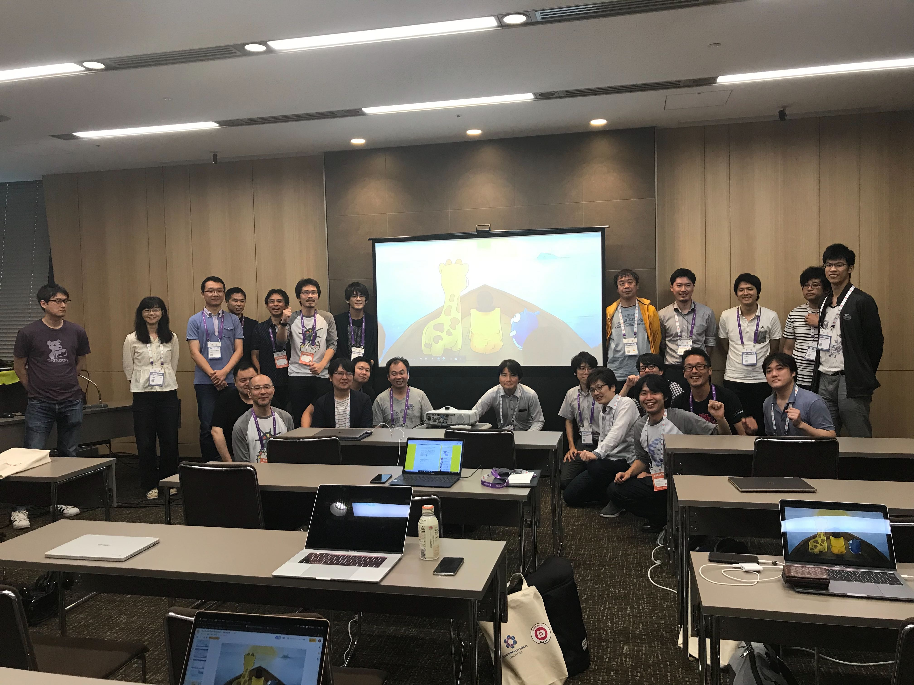

# CNDT 2019: Kubernetes Upstream Training

Welcome to Kubernetes Upstream Training!!
July 22th 2019 This is the location of our CNDT 2019 Kubernetes Upstream Training activities.

* [Slides](Kubernetes-Upstream-Training-in-CNDT2019.pdf)

## Docs

Get started with [Kubernbetes documentation](https://github.com/kubernetes/community/tree/master/contributors/guide)

## We got new contributors!! 

