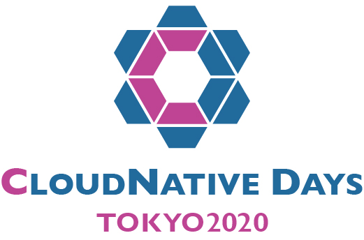

---

# CloudNative Days Tokyo 2020: Kubernetes Upstream Training

Welcome to Kubernetes Upstream Training!!

This is the location of [CloudNative Days Tokyo 2020](https://cndt2020.cloudnativedays.jp/): Kubernetes Upstream Training (Sep 7th 2020) activities.

## 資料 (Documents)

* [参加者の皆様への宿題 Attendee prerequisites (in preparation)](docs/attendee-prerequisites.md)
* [スライド Slides](docs/k8s-upstream-training-cndt-2020.pdf)
* [Kubernbetes contributors guide](https://github.com/kubernetes/community/tree/master/contributors/guide)

## We got new contributors!! 

 

