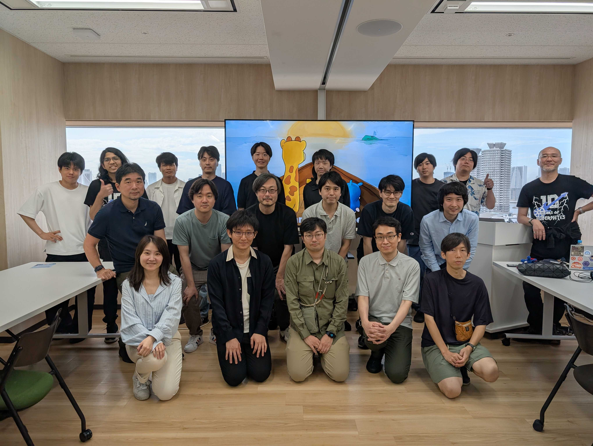

Kubernetes Upstream Training in Japan at [Japan Community Day 2025](https://community.cncf.io/events/details/cncf-cloud-native-community-japan-presents-japan-community-day-at-kubecon-cloudnativecon-japan-2025/)

Welcome to Kubernetes Upstream Training!!

This is the location of [Kubernetes Upstream Training](https://community.cncf.io/events/details/cncf-cloud-native-community-japan-presents-japan-community-day-at-kubecon-cloudnativecon-japan-2025/) (June 15th 2025) activities.

ここは、[CNCJ](https://community.cncf.io/cloud-native-community-japan/)のサブチャプターであるKubernetes Upstream Training Japan が [Japan Community Day 2025](https://community.cncf.io/events/details/cncf-cloud-native-community-japan-presents-japan-community-day-at-kubecon-cloudnativecon-japan-2025/) で 2025/5/22 に開催するトレーニングのためのページです。

[イベント概要と参加登録はこちら](https://community.cncf.io/events/details/cncf-cloud-native-community-japan-presents-japan-community-day-at-kubecon-cloudnativecon-japan-2025/)

## 資料 (Documents)

* [参加者の皆様への宿題 Attendee prerequisites (in preparation)](../assets/attendee-prerequisites.md)
* [スライド Slides](../assets/slide.pdf)
* [Kubernetes contributors guide](https://github.com/kubernetes/community/tree/master/contributors/guide)

## 講師（Facilitators）

| Icon                                                                                                                 | Name                                                     | Affiliation                   | Slack                   | Focus on, Role..                                                              |
| -------------------------------------------------------------------------------------------------------------------- | -------------------------------------------------------- | ----------------------------- | ----------------------- | ----------------------------------------------------------------------------- |
|          | <a href="https://github.com/shu-mutou">Shu Muto</a>      | NEC Solution Innovators, Ltd. | @Shu Muto               | - Chair of sig-ui  - Approver of k/dashboard - CNCF Ambassador          |
|           | <a href="https://github.com/ziyi-xie">Xie Ziyi</a>       | NEC Solution Innovators, Ltd. | @XIE ZIYI               | - sig-docs  - k/dashboard i18n ja                                          |
|             | <a href="https://github.com/atoato88">Akihito Inoh</a>   | NEC Solution Innovators, Ltd. | @akihito-inou(atoato88) | - Approver of kubernetes-sigs/kubebuilder-declarative-pattern   - sig-docs |
|        | <a href="https://github.com/Okabe-Junya">Junya Okabe</a> | University of Tsukuba         | @Junya Okabe            | - sig-docs Japanese l10n approver - CNCF Ambassador                        |
|           | <a href="https://github.com/nasa9084">nasa9084</a>       | LY Corporation                | @nasa9084               | - sig-docs Japanese l10n approver                                          |
|  | <a href="https://github.com/mkimuram">Masaki Kimura</a>  | Hitachi, Ltd.                 | @mkimura                | - sig-storage                                                                 |

## チューター（Tutors）

| Icon                                                                                                                 | Name                                                                 | Affiliation                              | Slack              | Focus on, Role..           |
| -------------------------------------------------------------------------------------------------------------------- | -------------------------------------------------------------------- | ---------------------------------------- | ------------------ | -------------------------- |
|  | <a href="https://github.com/sreeram-venkitesh">Sreeram Venkitesh</a> | Senior Software Engineer at DigitalOcean | @Sreeram Venkitesh | - Release Team v1.29-v1.34 |

## We got new contributors!!

