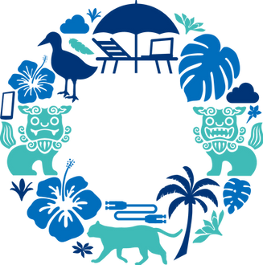

 

---

# Okinawa Open Days 2022: Kubernetes Upstream Training

Welcome to Kubernetes Upstream Training!!

This is the location of [Kubernetes Upstream Training](https://www.okinawaopendays.com/session-dec14-training)(Dec 14th 2022) activities.

## 資料 (Documents)

* [参加者の皆様への宿題 Attendee prerequisites (in preparation)](../assets/attendee-prerequisites.md)
* [スライド Slides](../assets/slide.pdf)
* [Kubernetes contributors guide](https://github.com/kubernetes/community/tree/master/contributors/guide)

## 講師（Facilitators）

| Icon | Name | Slack | Affiliation | Focus on, Role.. |
| ------------- | ------------- | ------------- | ------------- | ------------- |
|| <a href="https://github.com/oomichi">Kenichi Omichi</a> | @oomichi | NEC | - sig-testing  - Approver of k8s.io/kubernetes/test  - Owner of kubernetes-sigs/kubespray |
|| <a href="https://github.com/atoato88">Akihito Inoh</a> | @akihito-inou(atoato88) | NEC Solution Innovators | - sig-cluster-lifecycle  - Approver of kubernetes-sigs/kubebuilder-declarative-pattern   - k/dashboard i18n ja |
|| <a href="https://github.com/shu-mutou">Shu Muto</a> | @Shu Muto | NEC Solution Innovators | - Chair of sig-ui  - Approver of k/dashboard |
|| <a href="https://github.com/YuikoTakada">Yuiko Mouri</a> | @YuikoTakada | NEC Solution Innovators | - sig-storage  - sig-node |
|| <a href="https://github.com/ziyi-xie">Xie Ziyi</a> | @XIE ZIYI | NEC Solution Innovators | - sig-docs  - k/dashboard i18n ja  |
|| <a href="https://github.com/s-kawamura-w664">Shinji Kawamura</a> | @Shinji Kawamura (s-kawamura-w664)  | NEC Solution Innovators | - sig-node |
|| <a href="https://github.com/t-inu">Toshiaki Inukai</a> | @inukai | NEC Solution Innovators | - sig-docs - Reviewer of website/content/ja  - sig-node |

## We got new contributors!!

We will show the photo of new contributors after finishing the training.
<!--  -->

