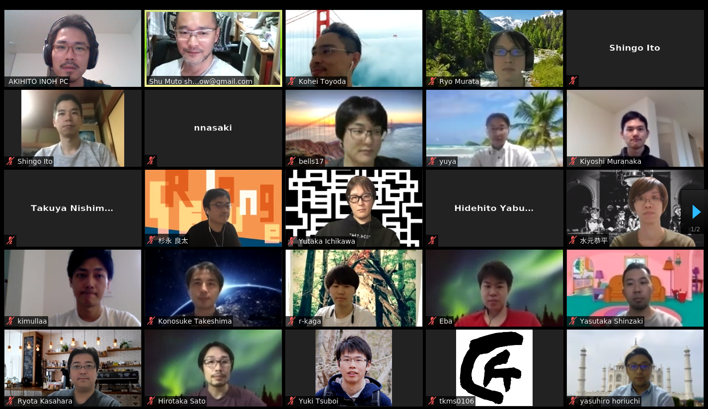
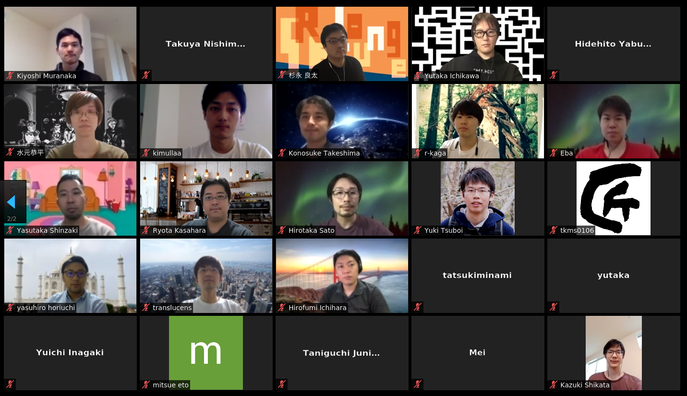

---

# KubeFest Tokyo 2020: Kubernetes Upstream Training

Welcome to Kubernetes Upstream Training!!

This is the location of our [KubeFest Tokyo 2020](https://k8sjp.connpass.com/event/176105/): [Kubernetes Upstream Training (June 13th 2020) activities](https://k8sjp.github.io/kubefest-2020/sessions/4/).

## 資料 (Documents)

* [参加者の皆様への宿題 Attendee prerequisites (in preparation)](docs/attendee-prerequisites.md)
* [スライド Slides](docs/k8s-upstream-training-kft-2020.pdf)
* [Kubernbetes contributors guide](https://github.com/kubernetes/community/tree/master/contributors/guide)

## We got new contributors!! 

 
